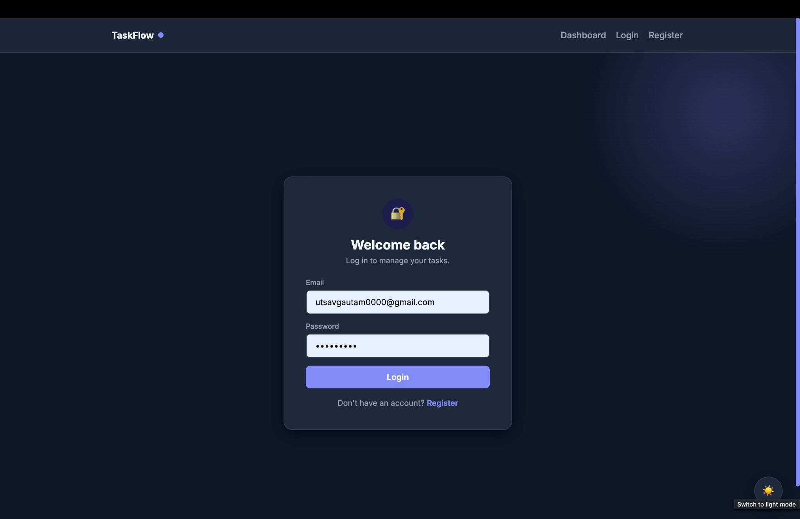
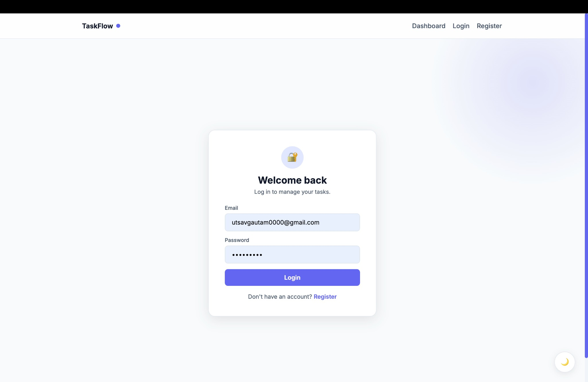
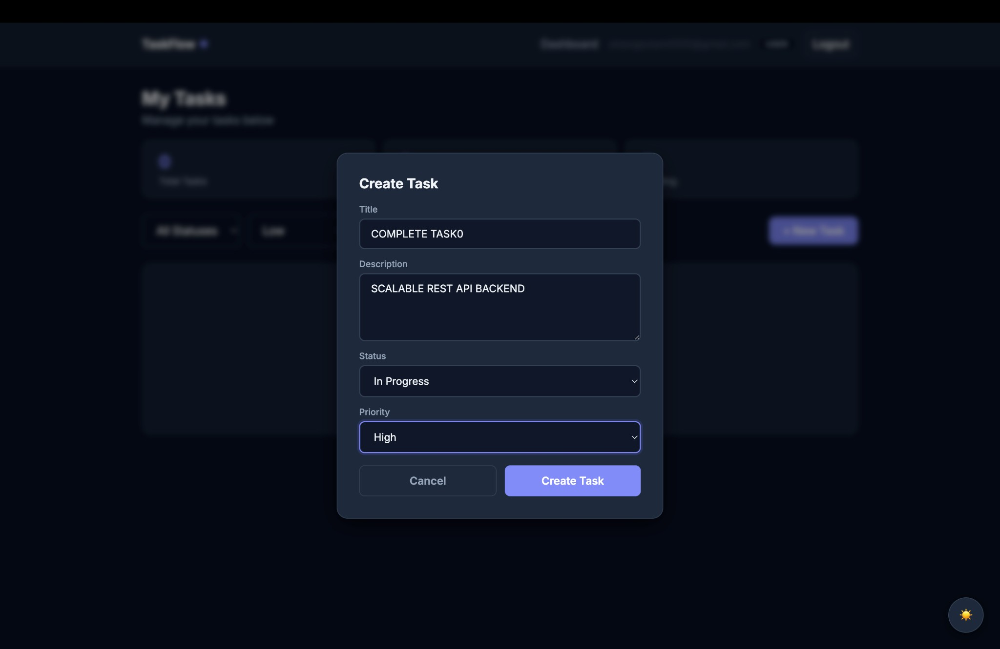
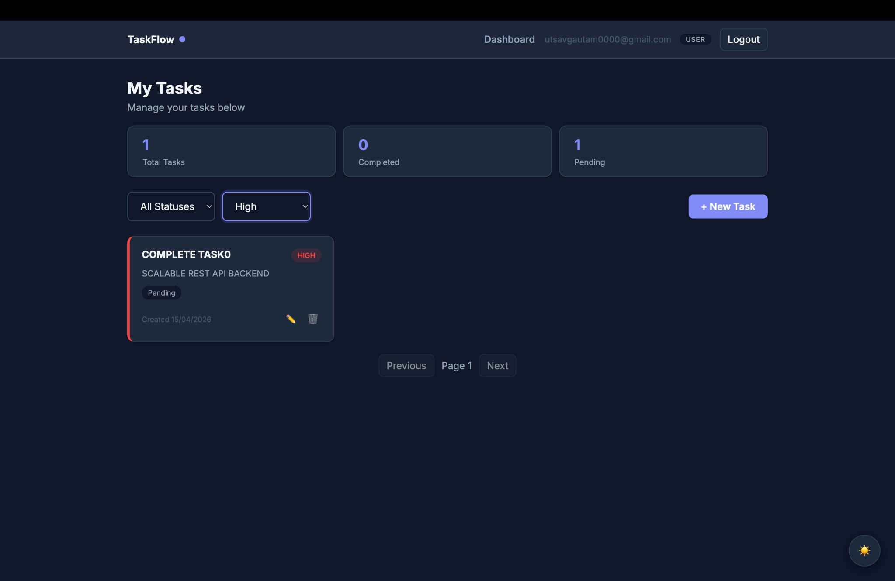
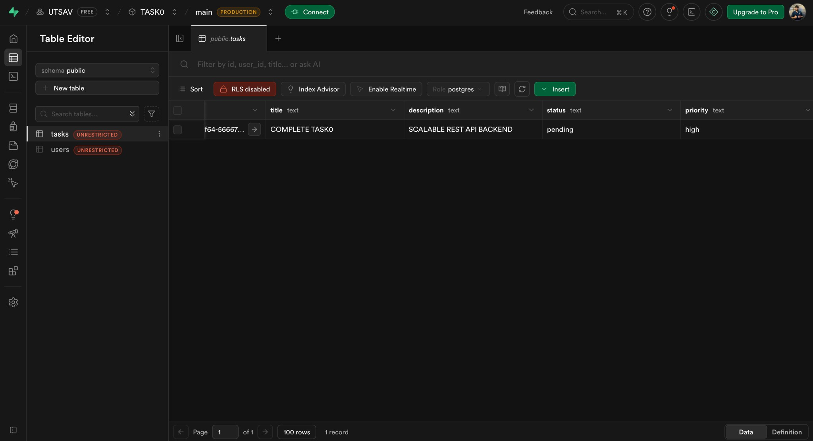
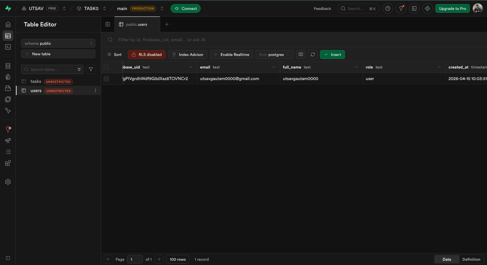

# Scalable REST API with Auth & Role-Based Access

## 1. Project Overview
This project is a production-structured full-stack task management app with Firebase Authentication, Supabase PostgreSQL, role-based access control, Swagger docs, Docker support, and a polished React UI.

## 2. Tech Stack
- Backend: Node.js, Express.js
- Frontend: React.js (Vite)
- Database: Supabase (PostgreSQL via Supabase JS client)
- Auth: Firebase Authentication + Firebase Admin SDK
- API Docs: Swagger (`swagger-ui-express`, `swagger-jsdoc`)
- Containerization: Docker + Docker Compose
- Security/Validation: `helmet`, `cors`, `express-validator`, `dotenv`, `bcryptjs`

## 3. Prerequisites
- Node.js 20+
- Docker and Docker Compose
- Supabase account/project
- Firebase project
- Netlify account (for frontend deployment)

## 4. Firebase Setup Steps
1. Create a Firebase project at [Firebase Console](https://console.firebase.google.com/).
2. Enable Email/Password provider under Authentication > Sign-in method.
3. Create a Web App in Firebase project settings and copy client SDK values.
4. Generate a service account key from Project Settings > Service Accounts.
5. Copy values from the service account JSON into backend environment variables:
   - `FIREBASE_PROJECT_ID`
   - `FIREBASE_CLIENT_EMAIL`
   - `FIREBASE_PRIVATE_KEY` (escaped with `\n` and wrapped in quotes)

## 5. Supabase Setup Steps
1. Create a Supabase project at [Supabase](https://supabase.com/).
2. Open SQL Editor and run the script below.
3. Copy project URL and secret/service role key into backend `.env`.

## Database Setup
```sql
create extension if not exists pgcrypto;

create table if not exists public.users (
  id uuid primary key default gen_random_uuid(),
  firebase_uid text unique not null,
  email text unique not null,
  full_name text,
  role text default 'user',
  created_at timestamptz default now()
);

create table if not exists public.tasks (
  id uuid primary key default gen_random_uuid(),
  user_id uuid references public.users(id) on delete cascade,
  title text not null,
  description text,
  status text default 'pending',
  priority text default 'medium',
  created_at timestamptz default now(),
  updated_at timestamptz default now()
);
```

## 6. Local Development Setup (Without Docker)
Backend:
```bash
cd backend
npm install
PORT=5001 npm run dev
```

Frontend:
```bash
cd frontend
npm install
npm run dev
```

Make sure frontend `.env` uses:
```env
VITE_API_BASE_URL=http://localhost:5001
```

## 7. Docker Setup
```bash
docker-compose up --build
```

## 8. API Documentation URL
[http://localhost:5001/api/docs](http://localhost:5001/api/docs)

## 9. Postman API Testing
Postman files are included at the project root:
- `TaskFlow.postman_collection.json`
- `TaskFlow.postman_environment.json`

Import both in Postman, then select environment **TaskFlow Local Environment**.

Default environment values:
- `baseUrl`: `http://localhost:5001`
- `token`: set manually after Firebase login
- `adminToken`: for admin-only endpoint tests
- `taskId`: auto-filled after task creation test
- `userId`: auto-filled after register test

## 10. Deployment (Submission-Friendly)
### Important
Netlify hosts the frontend perfectly, but Express backend must run on a backend host (Render/Railway/Fly/VM).  
So the practical working prototype setup is:
- Frontend: Netlify
- Backend API: Render/Railway (or any Node host)
- Supabase + Firebase remain managed services

### Deploy Backend (example on Render)
1. Push repo to GitHub.
2. Create a Render Web Service for `backend/`.
3. Build command: `npm install`
4. Start command: `node server.js`
5. Add backend env vars from `backend/.env`.
6. Set `PORT` from platform value (or keep default if platform injects one).

### Deploy Frontend on Netlify
1. In Netlify, create a new site from your GitHub repo.
2. Set **Base directory**: `frontend`
3. Build command: `npm run build`
4. Publish directory: `dist`
5. Add frontend env vars in Netlify:
   - `VITE_API_BASE_URL=https://<your-backend-domain>`
   - `VITE_FIREBASE_API_KEY=...`
   - `VITE_FIREBASE_AUTH_DOMAIN=...`
   - `VITE_FIREBASE_PROJECT_ID=...`
   - `VITE_FIREBASE_APP_ID=...`
6. Deploy and use Netlify URL as your submission prototype link.

## 11. UI Screenshots
### Login (Dark)


### Login (Light)


### Create Task Modal


### Dashboard with Task Card


### Supabase Tasks Table


### Supabase Users Table


## 12. Scalability Considerations
- Split into microservices over time:
  - `auth-service`: profile and RBAC management
  - `tasks-service`: task CRUD and querying
- Scale Express horizontally behind Nginx or AWS ALB.
- Add Redis caching for `GET /api/v1/tasks` (cache per user, invalidate on create/update/delete).
- Supabase uses PgBouncer connection pooling out of the box.
- Firebase Auth scales authentication independently; no custom scaling needed.
- Add per-user rate limiting via `express-rate-limit` + Redis store.
- Future async workflows can use BullMQ + Redis for notifications and background task processing.

## 13. Folder Structure Tree
```text
root/
├── backend/
│   ├── src/
│   │   ├── config/
│   │   │   ├── firebase.js
│   │   │   └── supabase.js
│   │   ├── middleware/
│   │   │   ├── authenticate.js
│   │   │   ├── authorize.js
│   │   │   └── validate.js
│   │   ├── routes/
│   │   │   └── v1/
│   │   │       ├── auth.routes.js
│   │   │       └── tasks.routes.js
│   │   ├── controllers/
│   │   │   ├── auth.controller.js
│   │   │   └── tasks.controller.js
│   │   ├── services/
│   │   │   ├── auth.service.js
│   │   │   └── tasks.service.js
│   │   ├── validators/
│   │   │   ├── auth.validator.js
│   │   │   └── tasks.validator.js
│   │   ├── docs/
│   │   │   └── swagger.js
│   │   └── app.js
│   ├── server.js
│   ├── .env.example
│   ├── Dockerfile
│   └── package.json
├── frontend/
│   ├── src/
│   │   ├── config/firebase.js
│   │   ├── context/AuthContext.jsx
│   │   ├── api/axiosInstance.js
│   │   ├── pages/
│   │   │   ├── Login.jsx
│   │   │   ├── Register.jsx
│   │   │   ├── Dashboard.jsx
│   │   │   └── AdminPanel.jsx
│   │   ├── components/
│   │   │   ├── TaskCard.jsx
│   │   │   ├── TaskForm.jsx
│   │   │   ├── ProtectedRoute.jsx
│   │   │   └── Navbar.jsx
│   │   ├── App.jsx
│   │   └── main.jsx
│   ├── .env.example
│   ├── Dockerfile
│   └── package.json
├── docker-compose.yml
├── TaskFlow.postman_collection.json
├── TaskFlow.postman_environment.json
├── docs/
│   └── screenshots/
│       ├── login-dark.png
│       ├── login-light.png
│       ├── task-modal.png
│       ├── dashboard-task.png
│       ├── supabase-tasks.png
│       └── supabase-users.png
└── README.md
```
